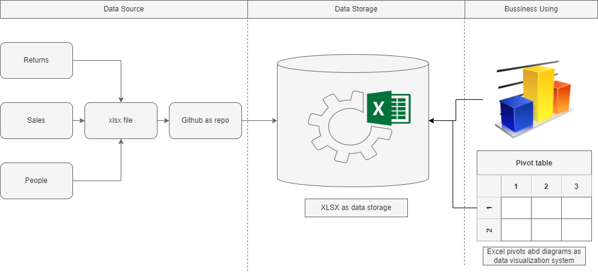

# Структура решения
[База данных](DataSample.xlsx) создана на основании левой части схемы (Data source), представленной на [схеме аналитического решения](Структура_аналитического_решения.png)

В результате обработки данных был создан [дашборд](Superstore_Dashboard_v1.xlsx), показывающий ключевые метрики по представленной базе данных

## Основные особенности базы данных:
### База данных содержит в себе следующую информацию:
- информация по продажам Гипермаркета на территории США (лист Orders)
- информация о менеджерах, ответственных за каждый часть страны (Север, Юг, Восток, Запад)
- информация о  возварщенных заказах

Расшифровка полей, содержащихся в [Базе данных](DataSample.xlsx) представлена в таблице ниже:

| Название столбца | Значение                          |
|------------------|-----------------------------------|
| Row ID           | Идентификатор строки (уникальный) |
| Order ID         | Идентификатор заказа              |
| Order Date       | Дата заказа                       |
| Ship Date        | Дата доставки                     |
| Ship Mode        | Класс доставки                    |
| Customer ID      | Идентификатор покупателя          |
| Customer Name    | Имя и фамилия покупателя          |
| Segment          | Сегмент покупателя                |
| Country          | Страна                            |
| City             | Город                             |
| State            | Штат                              |
| Postal Code      | Почтовый индекс                   |
| Region           | Регион                            |
| Product ID       | Идентификатор товара              |
| Category         | Категория                         |
| Sub-Category     | Подкатегория                      |
| Product Name     | Название товара                   |
| Sales            | Продажи (Доход)                   |
| Quantity         | Количество                        |
| Discount         | Скидка в %                        |
| Profit           | Прибыль                           |
| Person           | Региональный менеджер             |
| Returned         | Возвраты товара                   |

## Особенности Дашборда

### [Дашборд](Superstore_Dashboard_v1.xlsx)  разделен на три части:
- Непосредственно сам дашборд (Лист Dashboard)
- Расчетные таблицы, лежащие в основе дашборда (Листы Managers -> Days until shipment)
- Сама база данных (Orders -> Returns)